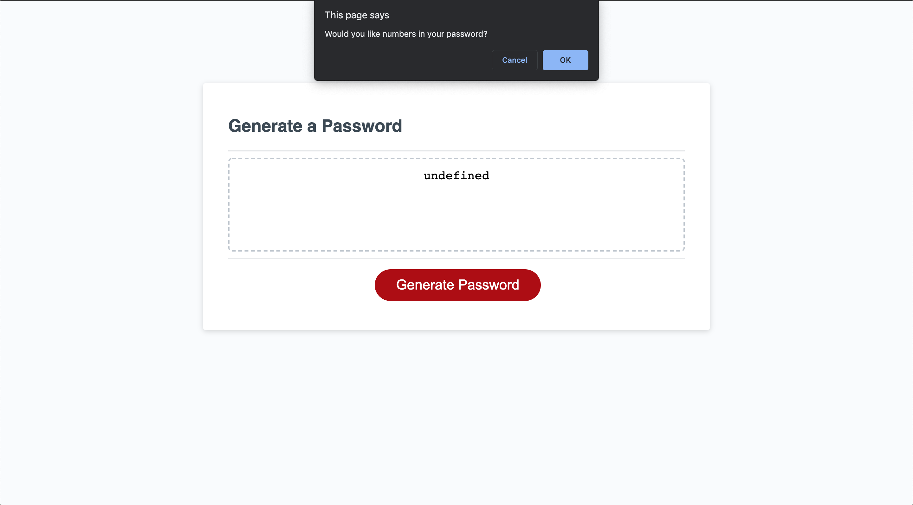

# random-password

What did I do 
In this assignment I made several new array variables with every possible criteria element. Then I created if statements inside my function so that if a person wanted that criteria in their password and they clicked it that array would be added into the random generator. I created a random generator by making a for loop that combined all the arrays the user chose to add to their password. I also checked to make sure they were entering correct values. Below are pictures of my website. 

Here are my URLs:
https://github.com/kaursim000/random-password
https://kaursim000.github.io/random-password/

